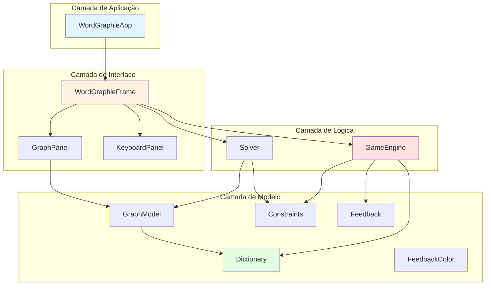
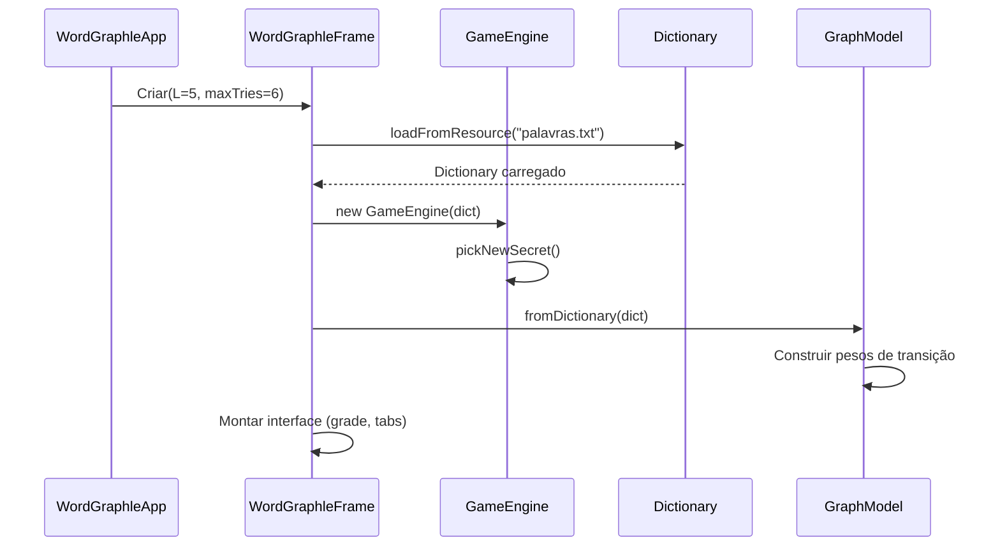
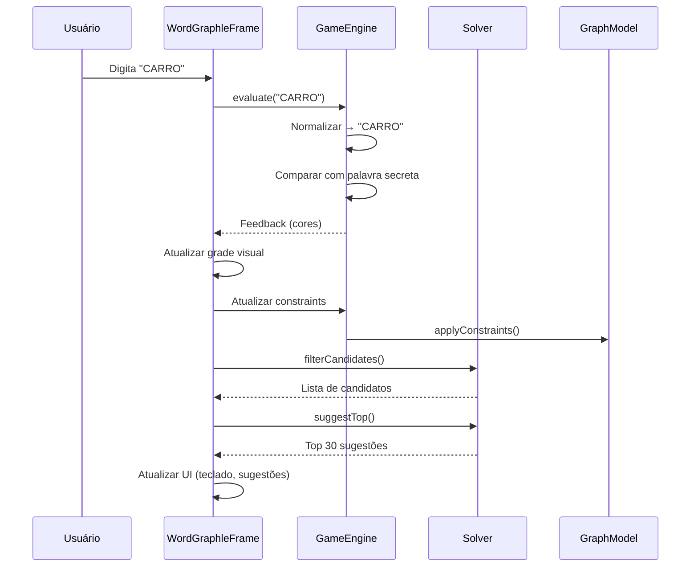
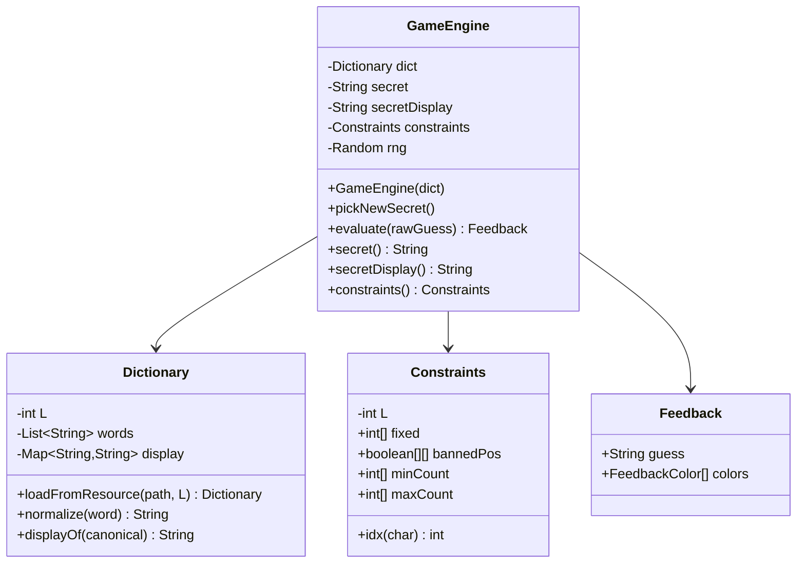
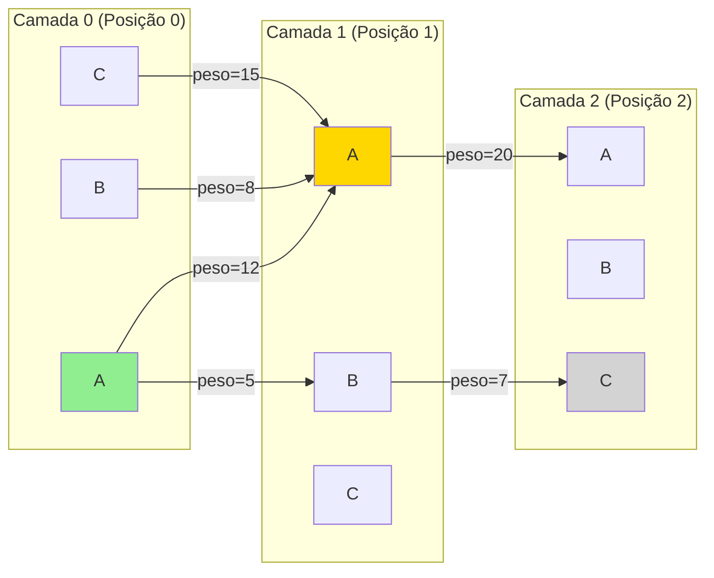
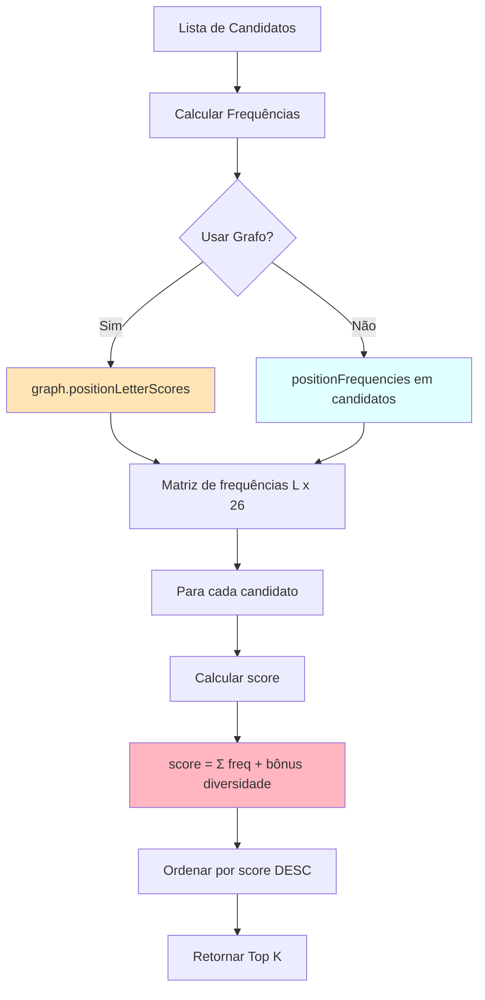
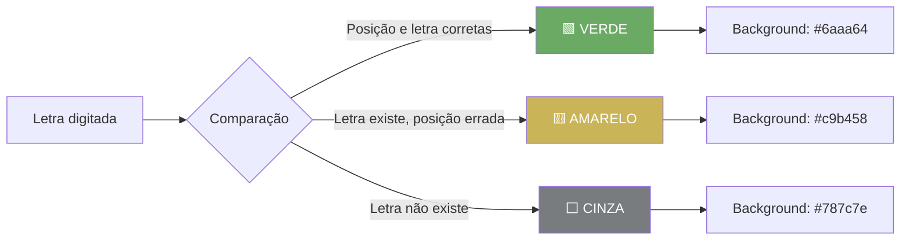
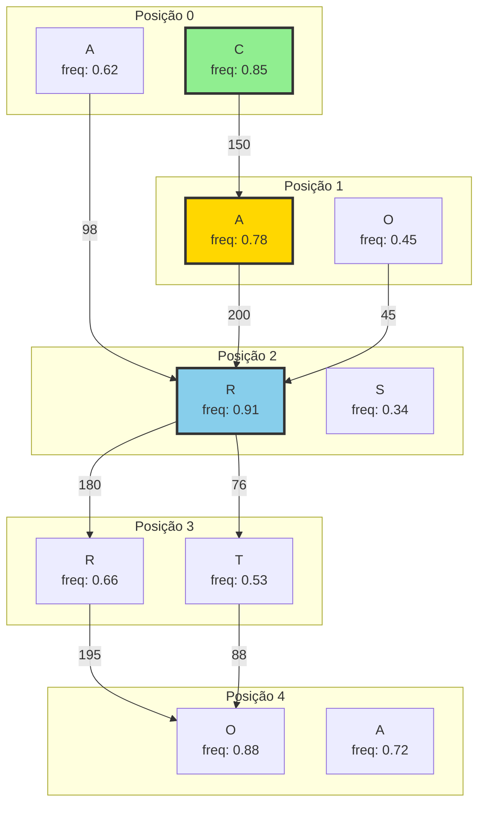
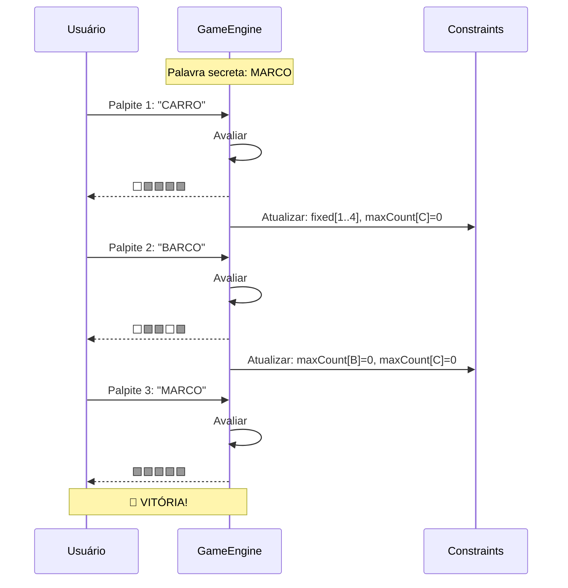
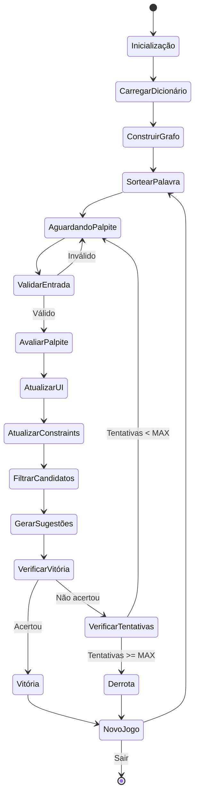

# WordGraphle - Documentação do Projeto

## 📋 Índice
- [Visão Geral](#visão-geral)
- [Arquitetura do Sistema](#arquitetura-do-sistema)
- [Estrutura de Pacotes](#estrutura-de-pacotes)
- [Fluxo de Dados](#fluxo-de-dados)
- [Componentes Principais](#componentes-principais)
- [Algoritmos e Lógica](#algoritmos-e-lógica)
- [Interface Gráfica](#interface-gráfica)

---

## 🎯 Visão Geral

**WordGraphle** é um jogo inspirado no Wordle, desenvolvido em Java, que adiciona funcionalidades avançadas como:
- Suporte a palavras em português (com acentuação)
- Sistema de grafo para análise de palavras
- Sugestões inteligentes baseadas em frequências
- Visualização gráfica das relações entre letras

### Características Principais
- **L = 5**: Palavras de 5 letras
- **MAX_TRIES = 6**: Até 6 tentativas
- **Dicionário PT-BR**: Com preservação de acentos para exibição
- **Normalização**: Lógica do jogo usa A–Z sem acentos

---

## 🏗️ Arquitetura do Sistema



---

## 📦 Estrutura de Pacotes

```
wordgraphle/
├── 📄 WordGraphleApp.java          # Ponto de entrada da aplicação
│
├── 🎮 engine/
│   └── GameEngine.java              # Motor do jogo (lógica principal)
│
├── 📊 graph/
│   └── GraphModel.java              # Modelo de grafo em camadas (DAG)
│
├── 📚 model/
│   ├── Dictionary.java              # Carregamento e normalização de palavras
│   ├── Constraints.java             # Sistema de restrições (verde/amarelo/cinza)
│   ├── Feedback.java                # Resultado de um palpite
│   └── FeedbackColor.java           # Enum: GREEN, YELLOW, GRAY
│
├── 🧠 solver/
│   └── Solver.java                  # Algoritmo de sugestões inteligentes
│
└── 🎨 ui/
    ├── WordGraphleFrame.java        # Janela principal (grade + abas)
    ├── GraphPanel.java              # Visualização do grafo
    └── KeyboardPanel.java           # Teclado visual com estados
```

---

## 🔄 Fluxo de Dados

### 1. Inicialização do Jogo



### 2. Fluxo de um Palpite



---

## 🔧 Componentes Principais

### 1. GameEngine (Motor do Jogo)



**Responsabilidades:**
- Sortear palavra secreta
- Avaliar palpites e gerar feedback colorido
- Atualizar restrições a cada rodada
- Normalizar entrada do usuário

---

### 2. GraphModel (Modelo de Grafo)



**Estrutura:**
- **Grafo Dirigido Acíclico (DAG)** em camadas
- **L camadas**: Uma para cada posição da palavra
- **26 nós por camada**: Uma para cada letra (A-Z)
- **Arestas com pesos**: Número de palavras com essa transição

**Exemplo:**
- Aresta (pos=0, 'C') → (pos=1, 'A') com peso=150
- Significa: 150 palavras no dicionário começam com "CA"

---

### 3. Sistema de Restrições (Constraints)

```mermaid
graph TD
    A[Palpite: CARRO] --> B{Comparar com Secreta}
    B --> C[🟩 GREEN: Posição correta]
    B --> D[🟨 YELLOW: Letra existe, posição errada]
    B --> E[⬜ GRAY: Letra não existe]
    
    C --> F[fixed[pos] = letra]
    D --> G[bannedPos[pos][letra] = true]
    D --> H[minCount[letra]++]
    E --> I[maxCount[letra] = contagem atual]
    
    F --> J[Constraints atualizados]
    G --> J
    H --> J
    I --> J
    
    J --> K[Filtrar candidatos]
    K --> L[Palavras válidas restantes]
    
    style C fill:#90EE90
    style D fill:#FFD700
    style E fill:#D3D3D3
```

**Tipos de Restrições:**

1. **Posição Fixa** (`fixed[]`)
   - Se letra está verde na posição i → `fixed[i] = letra`

2. **Proibição Local** (`bannedPos[][]`)
   - Se letra está amarela/cinza na posição i → `bannedPos[i][letra] = true`

3. **Contagem Mínima** (`minCount[]`)
   - Letra amarela/verde → aumenta `minCount[letra]`

4. **Contagem Máxima** (`maxCount[]`)
   - Letra cinza → define `maxCount[letra]` como contagem atual

---

### 4. Solver (Sistema de Sugestões)



**Algoritmo de Pontuação:**
```
score(palavra) = Σ(freq[pos][letra]) + 0.02 × (letras únicas)
```

**Estratégias:**
1. **Baseada em candidatos**: Conta frequências apenas nas palavras ainda possíveis
2. **Baseada em grafo**: Usa estrutura do grafo para estimar frequências globais

---

## 🎨 Interface Gráfica

### Estrutura da Janela Principal

```
┌─────────────────────────────────────────────────────────────┐
│  WordGraphle – PT-BR                                    [_][□][X]│
├─────────────────────────────────────────────────────────────┤
│                                                               │
│  ┌─────────────────────────┐  ┌──────────────────────────┐ │
│  │   GRADE DE PALPITES     │  │  ┌─────┬─────┬─────┐     │ │
│  │   ┌───┬───┬───┬───┬───┐ │  │  │Letras│Grafo│Sugest│   │ │
│  │   │ C │ A │ R │ R │ O │ │  │  └─────┴─────┴─────┘     │ │
│  │   ├───┼───┼───┼───┼───┤ │  │                          │ │
│  │   │   │   │   │   │   │ │  │  [Teclado Visual]        │ │
│  │   ├───┼───┼───┼───┼───┤ │  │   Q W E R T Y U I O P   │ │
│  │   │   │   │   │   │   │ │  │    A S D F G H J K L    │ │
│  │   ├───┼───┼───┼───┼───┤ │  │     Z X C V B N M       │ │
│  │   │   │   │   │   │   │ │  │                          │ │
│  │   ├───┼───┼───┼───┼───┤ │  │  🟩 Confirmada           │ │
│  │   │   │   │   │   │   │ │  │  🟨 Existe               │ │
│  │   ├───┼───┼───┼───┼───┤ │  │  ⬜ Descartada           │ │
│  │   │   │   │   │   │   │ │  └──────────────────────────┘ │
│  │   └───┴───┴───┴───┴───┘ │                              │
│  └─────────────────────────┘                              │
│                                                               │
│  ┌─────────────────────────────────────────────────────────┐ │
│  │ Digite: [_____________________________] [Enviar] [Novo] │ │
│  └─────────────────────────────────────────────────────────┘ │
└─────────────────────────────────────────────────────────────┘
```

### Sistema de Cores



---

## 🧮 Algoritmos e Lógica

### 1. Algoritmo de Avaliação de Palpite

```java
// Pseudocódigo simplificado
function evaluate(guess):
    1. Normalizar guess (remover acentos) → A-Z
    2. Verificar tamanho == L
    
    3. Contar letras na palavra secreta:
       remaining[letra] = quantidade
    
    4. PRIMEIRO PASSE (VERDE):
       para cada posição i:
           se guess[i] == secret[i]:
               colors[i] = GREEN
               remaining[guess[i]]--
    
    5. SEGUNDO PASSE (AMARELO/CINZA):
       para cada posição i não-verde:
           se remaining[guess[i]] > 0:
               colors[i] = YELLOW
               remaining[guess[i]]--
           senão:
               colors[i] = GRAY
    
    6. Atualizar Constraints baseado em colors
    7. Retornar Feedback(guess, colors)
```

### 2. Atualização de Constraints

```mermaid
flowchart TD
    A[Para cada letra do palpite] --> B{Cor?}
    
    B -->|🟩 GREEN| C[fixed[pos] = letra]
    B -->|🟨 YELLOW| D[bannedPos[pos][letra] = true]
    B -->|⬜ GRAY| E[Contagem atual da letra]
    
    C --> F[minCount[letra]++]
    D --> F
    
    E --> G{Letra tem GREEN/YELLOW?}
    G -->|Sim| H[maxCount[letra] = contagem]
    G -->|Não| I[maxCount[letra] = 0]
    
    F --> J[Constraints atualizados]
    H --> J
    I --> J
    
    style C fill:#90EE90
    style D fill:#FFD700
    style E fill:#D3D3D3
```

### 3. Filtragem de Candidatos

```java
function filterCandidates(dict, constraints):
    candidatos_validos = []
    
    para cada palavra w em dict:
        se isValid(w, constraints):
            adicionar w em candidatos_validos
    
    retornar candidatos_validos

function isValid(palavra, constraints):
    // Verificar restrições de posição
    para cada posição i:
        se constraints.fixed[i] != -1:
            se palavra[i] != constraints.fixed[i]:
                retornar false
        
        se constraints.bannedPos[i][palavra[i]]:
            retornar false
    
    // Verificar restrições de contagem
    contagem = contar_letras(palavra)
    
    para cada letra:
        se contagem[letra] < constraints.minCount[letra]:
            retornar false
        
        se constraints.maxCount[letra] >= 0:
            se contagem[letra] > constraints.maxCount[letra]:
                retornar false
    
    retornar true
```

---

## 📊 Visualização do Grafo

### Estrutura de Nós e Arestas



**Legenda:**
- **Nós**: Letras em cada posição com frequência normalizada
- **Arestas**: Peso = número de palavras com essa transição
- **Cores**: Indicam ativação baseada em constraints

---

## 🎯 Exemplo Completo de Jogo



---

## 🔍 Detalhes Técnicos

### Normalização de Palavras

```java
// Exemplo de normalização
"café"   → "CAFE"
"maçã"   → "MACA"
"José"   → "JOSE"
"açúcar" → "ACUCAR"
```

**Processo:**
1. Aplicar NFD (decomposição Unicode)
2. Remover diacríticos combinados
3. Substituir 'ç' → 'c'
4. Remover não-letras
5. Converter para maiúsculas

### Estrutura de Dados do Grafo

```
wBase[pos][letraA][letraB] = peso da transição
active[pos][letra] = nó ativo após aplicar constraints

Exemplo:
wBase[0]['C'-'A']['A'-'A'] = 150  // 150 palavras começam com "CA"
active[0]['C'-'A'] = true          // 'C' permitido na posição 0
```

---

## 🚀 Fluxo de Execução Completo



---

## 📈 Complexidade e Performance

### Complexidade Computacional

| Operação | Complexidade | Descrição |
|----------|-------------|-----------|
| Carregar Dicionário | O(N) | N = número de palavras |
| Construir Grafo | O(N × L) | Processar todas transições |
| Avaliar Palpite | O(L) | Comparar L letras |
| Filtrar Candidatos | O(N × L) | Verificar N palavras |
| Calcular Frequências | O(N × L) | Contar em todos candidatos |
| Sugerir Top K | O(N log K) | Ordenação parcial |

### Otimizações Implementadas

1. **Grafo Pré-computado**: Transições calculadas uma vez
2. **Filtragem Incremental**: Apenas candidatos válidos
3. **Normalização em Cache**: Mapa canônico → exibição
4. **Top-K Heap**: Evita ordenação completa

---

## 🎓 Conceitos Aplicados

### 1. Grafos Dirigidos Acíclicos (DAG)
- Estrutura em camadas para análise de palavras
- Arestas com pesos representam frequências

### 2. Programação Orientada a Objetos
- Separação de responsabilidades
- Encapsulamento de lógica complexa
- Reutilização de código

### 3. Padrões de Design
- **MVC**: Model (engine/model) - View (ui) - Controller (engine)
- **Strategy**: Diferentes métodos de sugestão
- **Observer**: Atualização de UI baseada em estado

### 4. Estruturas de Dados
- Arrays multidimensionais (grafo, constraints)
- Listas para candidatos
- Maps para normalização

### 5. Algoritmos
- Filtragem com predicados
- Ordenação por score
- Contagem de frequências

---

## 📝 Glossário

| Termo | Descrição |
|-------|-----------|
| **Palavra Canônica** | Forma normalizada A-Z sem acentos |
| **Palavra de Exibição** | Forma original com acentos |
| **Feedback** | Resultado de um palpite (cores) |
| **Constraints** | Restrições acumuladas do jogo |
| **Candidatos** | Palavras ainda possíveis |
| **Grafo em Camadas** | DAG com L camadas para L posições |
| **Transição** | Aresta entre letras em posições consecutivas |
| **Score** | Pontuação para ranking de sugestões |

---

## 🛠️ Tecnologias Utilizadas

- **Java 8+**: Linguagem principal
- **Swing**: Interface gráfica
- **Unicode Normalizer**: Tratamento de acentos
- **Streams API**: Filtragem e ordenação funcional

---

## 📦 Arquivos do Projeto

```
wordgraphle/
├── palavras.txt                    # Dicionário PT-BR (UTF-8)
├── WordGraphleApp.java            # Entry point
├── engine/
│   └── GameEngine.java            # Lógica do jogo
├── graph/
│   └── GraphModel.java            # Estrutura de grafo
├── model/
│   ├── Dictionary.java            # Carregamento de palavras
│   ├── Constraints.java           # Sistema de restrições
│   ├── Feedback.java              # Resultado de palpite
│   └── FeedbackColor.java         # Enum de cores
├── solver/
│   └── Solver.java                # Algoritmo de sugestões
└── ui/
    ├── WordGraphleFrame.java      # Janela principal
    ├── GraphPanel.java            # Visualização de grafo
    └── KeyboardPanel.java         # Teclado visual
```

---

## 🎯 Conclusão

O **WordGraphle** combina conceitos de:
- ✅ Teoria de Grafos
- ✅ Estruturas de Dados
- ✅ Algoritmos de Busca e Filtragem
- ✅ Interface Gráfica Rica
- ✅ Processamento de Linguagem Natural (normalização)

Criando uma experiência de jogo educativa e tecnicamente robusta! 🚀

---

**Desenvolvido com ❤️ em Java**
